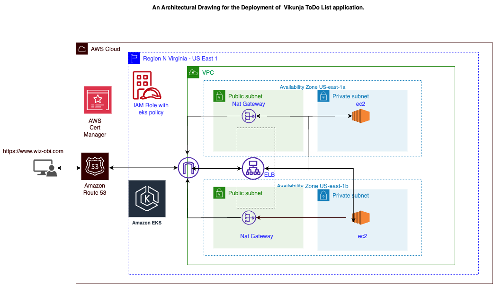

# Configuration of Todo-app using Highly Available aws EKS

The automation tool used to deploy the different infrastructures for Todo app project is **helm**.
Helm is a package manager for kubernetes delivery tool and we are going to configure our infrastructure using it.

I provisioned the infrastructure using terraform and deployed the application in AWS Cloud
I utilized aws s3 bucket for the remote state storage, IAM for Identity and access management, vpc for isolation and security, i utilized multiple azs for high availability and fault tolerance. Deploying ELB in the public subnet while my application runs in the private subnet for security, Internet gateway.
I utilized NAT gateway to ensure resources in the private subnet has access to the internet securely.

I implemented security group rule at the instance level and NACL at the subnet level for security enhancements while allowing the appropriate port.
The reference architecture is attached here and made i use of instances that are memory optimized.

I utilized aws certificate manager for ssl/tls termination. I utilized memory optimized R5 Instances: These instances are designed to provide a balance of compute, memory, and networking resources. and Network optimized  HPC6id  Instances in the HPC family are optimized for network performance and are suitable for demanding high-performance computing workloads.

## Global architecture



## Infrastructure provisioning

Infra Provisioning:

- Clone the repository and run the following command:

```bash
cd ./iac
terraform init
terraform fmt
terraform validate
terraform plan
terraform apply -auto-approve
aws eks update-kubeconfig --name demo --region us-east-1


## Preparation

Pre-requisites:

- vikunja-application-helm-repository:
  Add Helm repositories like truecharts for essential dependencies in Todo app deployment. These repositories provide necessary components such as:
  **ingress, prometheus,k8s-at-home** as shown below

```bash
helm repo add truecharts https://charts.truecharts.org/

#validate by running
```bash
helm repo ls


  NAME            URL
prometheus      https://prometheus-community.github.io/helm-charts
ingress-nginx   https://kubernetes.github.io/ingress-nginx
ingress         https://kubernetes.github.io/ingress-nginx
elasticsearch   https://helm.elastic.co
kibana          https://helm.elastic.co
grafana         https://romanow.github.io/helm-charts/
filebeat        https://helm.elastic.co
k8s-at-home     https://k8s-at-home.com/charts/
truecharts      https://charts.truecharts.org/

Deployed the Todoapp using this chart "https://k8s-at-home.com/charts/" as it aligns with my requirement and stable when compared to the version
The [truecharts](https://kolaente.dev/vikunja/helm-chart.git) deployed is buggy causing the api pods to continuously crashlooping even while following the best practice to troubleshoot it.
I contacted the developers of the app and from my research everyone has faced that issue without resolution and considering the time frame to deliver my project i moved with deploying the application "https://k8s-at-home.com/charts/"

```

1. We have to deploy some dependencies that our application requires.
2. We are using postgres db for this deployment with kubernetes object statefulsets.
3. The persistent volume is set in a way that requires dynamic provisioning of pv by the storage class. The pod will remain pending without deploying EBS CSI Driver.

```bash
kubectl apply -k "github.com/kubernetes-sigs/aws-ebs-csi-driver/deploy/kubernetes/overlays/stable/?ref=master"
important: Your terraform code should also have a policy called AmazonEBSCSIDriverPolicy added to the nodegroup that will allow it ec2 to create pv

Verify ebs-csi pods running

```bash
kubectl get pods -n kube-system
kubectl logs <pod_name>


Database Deployment Strategy Justification:

## Database Deployment Strategy Justification

Before deploying the Vikunja Todo app, a careful consideration of the database deployment strategy was undertaken to ensure stability, reliability, and optimal performance. The chosen approach involves utilizing PostgreSQL in conjunction with Kubernetes StatefulSets. This decision aligns with the task requirements and Kubernetes best practices, ensuring a robust and well-supported solution.

### 1. Stability and Reliability

- **Explanation:** StatefulSets in Kubernetes provide stable and unique network identifiers, ensuring consistent network identities for each database instance.
- **Relevance:** This stability is essential for the reliability of the database service, supporting operations such as backups, replication, and failover.

### 2. Persistent Storage

- **Explanation:** StatefulSets enable the use of persistent volumes, ensuring stable and persistent storage for the PostgreSQL database.
- **Relevance:** Persistent volumes are crucial for databases, providing data durability and consistency, even during pod rescheduling or restarts.

### 3. Ordered, Graceful Deployment and Scaling

- **Explanation:** StatefulSets facilitate ordered, graceful deployment, and scaling of database instances.
- **Relevance:** This characteristic is critical for databases, where changes to the schema or updates to the database engine require careful coordination and sequencing.

### 4. Automated Rolling Updates

- **Explanation:** StatefulSets support automated rolling updates, minimizing downtime during updates or changes.
- **Relevance:** Automated rolling updates are essential for maintaining the availability of the database service.

### 5. Comparison with Managed Services

- **Explanation:** While managed database services offer convenience, using StatefulSets provides more control over the database deployment.
- **Relevance:** StatefulSets offer greater control and customization, allowing tailoring the database environment to the specific needs of the Todo app.

### 6. Consideration of Future Scalability

- **Explanation:** The choice considers the future scalability needs of the Todo app.
- **Relevance:** StatefulSets lay the foundation for future scalability, allowing easy addition of new instances as the application grows.

### 7. Alignment with Kubernetes Best Practices

- **Explanation:** Choosing StatefulSets aligns with Kubernetes best practices for deploying stateful applications.
- **Relevance:** StatefulSets are recommended for running databases on Kubernetes, providing a robust and well-supported solution.

**Important Note:** The utilization of StatefulSets for the database deployment and postgres db was based on the need for stable, unique network identifiers, persistent storage, ordered deployment and scaling, as well as ordered, automated rolling updates. For further details, refer to the [Kubernetes StatefulSet documentation](https://kubernetes.io/docs/concepts/workloads/controllers/statefulset/).


# install Todo app
helm install my-vikunja k8s-at-home/vikunja --namespace default

#validate
```bash
helm ls -n default
kubectl get pods -n default
kubectl get svc,ep
kubectl logs <pod-name>

#validate service is resolving connection to the backend pods
kubectl run alpine --image=alpine/curl -- sleep 20000
kubectl exec alpine -- curl my-vikunja:8080 #where my-vikunja is your service name


#install Monitoring tool
helm install prometheus prometheus/prometheus --namespace monitoring --create-namespace
#validate
```bash
kubectl get all -n monitoring
#Check the container logs

helm install grafana grafana/grafana --namespace grafana --create-namespace -f grafana-values.yaml
#updated the grafana values file to disable ingress.
#validate
```bash
kubectl get pods,svc,ep -n grafana
kubectl get all -n grafana

# upgrade the prometheus revision with an alertmanager rule

Create this file :
- alertmanager.yaml

```yaml
alertmanagerFiles:
  alertmanager.yml:
    global:
      resolve_timeout: 1m
      # slack_api_url: ''

    receivers:
      # - name: 'gmail-notifications'
      #   email_configs:
      #   - to:xxx
      #     from: xxx # Update your from mail id here
      #     smarthost: smtp.gmail.com:587
      #     auth_username: xxx # Update your from mail id here
      #     auth_identity: xxx # Update your from mail id here
      #     auth_password: password2020 # Update your password here
      #     send_resolved: true
      #     headers:
      #       subject: " Prometheus -  Alert  "
      #     text: "{{ range .Alerts }} Hi, \n{{ .Annotations.summary }}  \n {{ .Annotations.description }} {{end}} "
      #   # slack_configs:
      #   #  - channel: '@you'
      #   #    send_resolved: true

    route:
      group_wait: 10s
      group_interval: 2m
      receiver: 'gmail-notifications'
      repeat_interval: 2m
serverFiles:
  alerting_rules.yml:
      groups:
      - name: NodeDown
        rules:
        # Alert for any instance that is unreachable for >5 minutes.
        - alert: InstanceDown
          expr: up{job="kubernetes-nodes"} == 0
          for: 2m
          labels:
            severity: page
          annotations:
            host: "{{ $labels.kubernetes_io_hostname }}"
            summary: "Instance down"
            description: "Node {{ $labels.kubernetes_io_hostname  }}has been down for more than 5 minutes."
      - name: low_memory_alert
        rules:
        - alert: LowMemory
          expr: (node_memory_MemAvailable_bytes /  node_memory_MemTotal_bytes) * 100 < 85
          for: 2m
          labels:
            severity: warning
          annotations:
            host: "{{ $labels.kubernetes_node  }}"
            summary: "{{ $labels.kubernetes_node }} Host is low on memory.  Only {{ $value }}% left"
            description: "{{ $labels.kubernetes_node }}  node is low on memory.  Only {{ $value }}% left"
        - alert: KubePersistentVolumeErrors
          expr: kube_persistentvolume_status_phase{job="kubernetes-service-endpoints",phase=~"Failed|Pending"} > 0
          for: 2m
          labels:
            severity: critical
          annotations:
            description: The persistent volume {{ $labels.persistentvolume }} has status {{ $labels.phase }}.
            summary: PersistentVolume is having issues with provisioning.
        - alert: KubePodCrashLooping
          expr: rate(kube_pod_container_status_restarts_total{job="kubernetes-service-endpoints",namespace=~".*"}[5m]) * 60 * 5 > 0
          for: 2m
          labels:
            severity: warning
          annotations:
            description: Pod {{ $labels.namespace }}/{{ $labels.pod }} ({{ $labels.container }}) is restarting {{ printf "%.2f" $value }} times / 5 minutes.
            summary: Pod is crash looping.
        - alert: KubePodNotReady
          expr: sum by(namespace, pod) (max by(namespace, pod) (kube_pod_status_phase{job="kubernetes-service-endpoints",namespace=~".*",phase=~"Pending|Unknown"}) * on(namespace, pod)    group_left(owner_kind) topk by(namespace, pod) (1, max by(namespace, pod, owner_kind) (kube_pod_owner{owner_kind!="Job"}))) > 0
          for: 2m
          labels:
            severity: warning
          annotations:
            description: Pod {{ $labels.namespace }}/{{ $labels.pod }} has been in a non-ready state for longer than 5 minutes.
            summary: Pod has been in a non-ready state for more than 2 minutes.

            Reference: https://prometheus.io/docs/alerting/latest/configuration/

```bash
helm upgrade --install prometheus prometheus/prometheus --namespace  monitoring --create-namespace -f alertmanager.yaml

#validate that the revision was successful and the pods are running
```bash
helm ls -n monitoring
kubectl get pods,svc,ep -n monitoring
kubectl get all -n monitoring


- We will deploy ingress controller from the official nginx documentation:
Nginx as the Ingress controller to facilitate SSL/TLS termination using AWS Certificate Manager for secure application access. Ensure routing is configured for each application component.
 Ingress Nginx is not an ordinary LB, its a layer 7 https loadbalancer with sofisticated ehancement and security.

wget https://raw.githubusercontent.com/kubernetes/ingress-nginx/controller-v1.8.2/deploy/static/provider/aws/nlb-with-tls-termination/deploy.yaml
```

1. Download the deploy.yaml template

2. Edit the file and change the VPC CIDR in use for the Kubernetes cluster:
proxy-real-ip-cidr: XXX.XXX.XXX/XX

3. Change the AWS Certificate Manager (ACM) ID as well:
arn:aws:acm:us-west-2:XXXXXXXX:certificate/XXXXXX-XXXXXXX-XXXXXXX-XXXXXXXX

4. Set up projects CR

Create these 2 files :

```bash
kubectl apply -f deploy.yaml

#validate that the ingress controller pod is running
kubectl get all -n ingress-nginx
kubectl get pods,ep,svc -n ingress-nginx
kubectl logs <pod-name> -n ingress-nginx
kubectl get svc -n kube-system <ingress-controller-service-name>


- Create **ingressresource** for vikunja todoapp, prometheus server, alertmanager and grafana

create a namespace (monitoring and grafana)
apply the two files below

```bash
kubectl apply -f todoapp-ingressresource-vikunja.yaml

kubectl apply -f todoapp-ingressresource-prometheus.yaml

- todoapp-ingressresource-vikunja.yaml :

```yaml
apiVersion: networking.k8s.io/v1
kind: Ingress
metadata:
  namespace: default
  name: host-ingress
  annotations:
    nginx.ingress.kubernetes.io/rewrite-target: /
    nginx.ingress.kubernetes.io/ssl-redirect: "false"
spec:
  ingressClassName: nginx
  rules:
  - host: www.wiz-obi.com
    http:
      paths:
      - pathType: Prefix
        path: "/"
        backend:
          service:
            name: my-vikunja
            port:
              number: 10220

- todoapp-ingressresource-prometheus.yaml :

```yaml
apiVersion: networking.k8s.io/v1
kind: Ingress
metadata:
  name: prometheus-server-ingress-rule
  namespace: monitoring
spec:
  ingressClassName: nginx
  rules:
  - host: prometheus.wiz-obi.com
    http:
      paths:
      - pathType: Prefix
        path: "/"
        backend:
          service:
            name: prometheus-server
            port:
              number: 80
---
 apiVersion: networking.k8s.io/v1
 kind: Ingress
 metadata:
   name: grafana-ingress-rule
   namespace: grafana
 spec:
   ingressClassName: nginx
   rules:
   - host: grafana.wiz-obi.com
     http:
       paths:
       - pathType: Prefix
         path: "/"
         backend:
           service:
             name: grafana
             port:
               number: 3000
---
  apiVersion: networking.k8s.io/v1
  kind: Ingress
  metadata:
    name: alertmanager-ingress-rule
    namespace: monitoring
  spec:
    ingressClassName: nginx
    rules:
    - host: alertmanager.wiz-obi.com
      http:
        paths:
        - pathType: Prefix
          path: "/"
          backend:
            service:
              name: prometheus-alertmanager
              port:
                number: 9093
---
#validate that the ingress resource where created in the appropriate namespaces
```bash
kubectl get ingress -A
kubectl describe ingress -n grafana <ingress-resource-name> #check if its routing to the correct backend service
kubectl describe ingress -n monitoring <ingress-resource-name> #check if its routing to the correct backend service
kubectl describe ingress -n default <ingress-resource-name> #check if its routing to the correct backend service

#verify the ELB created by the ingress controller and use add it to your hostedzone on aws
kubectl get svc -n ingress-nginx

Create an alias in aws route 53 using the hosted zone (wiz-obi.com)
- Create a alias with (www, grafana, alertmanager, prometheus)


Reference: https://kubernetes.io/docs/concepts/services-networking/ingress/
```

#Validate that the traffic are routing accordingly by visiting https://www.wiz-obi.com on your browser and test the rest of the subdomain

Ensuring High availability of todoapp:
Deployed Metrics Server and Horizontal Pod Autoscaler (HPA) to collect resource metrics and automatically scale the Todo app based on demand, ensuring high availability.

1. Deployed Metrics Server to collect resource usage metrics from the kubelet's cAdvisor, and these metrics will be exposed to the Horizontal Pod Autoscaler (HPA) via the Kubernetes API server. HPA uses these metrics to make decisions about scaling the number of replicas based on observed resource utilization.

2. Create hpa, with the aim of automatically scaling the workload to match demand.

- Create **hpa definition file**

- hpa.yaml :

```yaml
apiVersion: autoscaling/v2beta2
kind: HorizontalPodAutoscaler
metadata:
  name: vikunja-hpa
spec:
  scaleTargetRef:
    apiVersion: apps/v1
    kind: Deployment
    name: my-vikunja #specify the vikunja deployment (my-vikunja)
  minReplicas: 1
  maxReplicas: 50
  metrics:
  - type: Resource
    resource:
      name: cpu
      target:
        type: Utilization
        averageUtilization: 50


```bash
#validate that the metrics server is created and running
kubectl apply -f https://github.com/kubernetes-sigs/metrics-server/releases/latest/download/components.yaml
 kubectl get pod -n kube-system <metrics-server-pod-name>
kubectl logs -n kube-system <metrics-server-pod-name>
kubectl top nodes
kubectl top pods
kubectl top pods --containers

Deploy the hpa by running
kubectl apply -f hpa.yaml

#validate hpa deployment
kubectl get hpa
The below is the output of the kubectl get hpa command, showing that vikunja deployment has no resource request and limit defined and
as a result the hpa has no resource to target <unknown>/50%

NAME          REFERENCE               TARGETS         MINPODS   MAXPODS   REPLICAS   AGE
vikunja-hpa   Deployment/my-vikunja   <unknown>/50%   1         10        1          12m


```
# Vikunja Helm Chart Documentation

## Generate Vikunja Values File

To get the values file for the Todo Vikunja application, run the following command:

```bash
helm show values k8s-at-home/vikunja > vikunja-values.yaml
```

## Upgrade Helm Release with Resource Requests and Limits

To upgrade the Helm release and add resource requests and limits, follow these steps:

1. List Helm releases:

```bash
helm ls
```

2. Upgrade the Helm release:

```bash
helm upgrade my-vikunja k8s-at-home/vikunja -f vikunja-values.yaml
# or
# helm upgrade <release name> k8s-at-home/vikunja -f vikunja-values.yaml
```

Replace `<release name>` with the actual release name if it's different.

```
Alternatively, simply run:
kubectl replace --force -f backend.yaml

#validate hpa
```bash
➜  todoapp git:(main) ✗ kubectl get hpa
NAME          REFERENCE               TARGETS   MINPODS   MAXPODS   REPLICAS   AGE
vikunja-hpa   Deployment/my-vikunja   0%/50%    1         10        1          12m
kubectl describe hpa vikunja-hpa
kubectl get events


Reference: https://kubernetes.io/docs/tasks/run-application/horizontal-pod-autoscale-walkthrough/
Alternatively you can run the scaling by running imperatively as shown below

```bash
kubectl autoscale deployment my-vikunja --cpu-percent=50 --min=1 --max=50

#validate hpa was deployed and test with a load generate
```bash
kubectl get hpa
kubectl get svc my-vikunja
Run this in a separate terminal
kubectl run -i --tty load-generator --rm --image=busybox:1.28 --restart=Never -- /bin/sh -c "while sleep 0.01; do wget -q -O- http://my-vikunja:8080; done"
#where my-vikunja is your service name

## Load Testing with kubectl run

### Description

The following `kubectl run` command is used to create a BusyBox pod named "load-generator," simulating continuous traffic to the "my-vikunja" service. This load generator allows for the observation of the service's performance under sustained requests.

```bash
kubectl run -i --tty load-generator --rm --image=busybox:1.28 --restart=Never -- /bin/sh -c "while sleep 0.01; do wget -q -O- http://my-vikunja:8080; done"

Observations

The load generator sends HTTP requests to the "my-vikunja" service at port 8080, simulating sustained traffic for performance testing.
Continuous monitoring of the Horizontal Pod Autoscaler (HPA) can be achieved by running kubectl get hpa -w. This command provides real-time updates on the HPA's activity, reflecting dynamic adjustments to the number of pod replicas based on observed load.


Implement Cluster Autoscaler to optimize costs and ensure elasticity by automatically adjusting the number of nodes in the EKS cluster based on workload demands.
Ensuring replication of nodes to meet our workload demand i deployed cluster auto scaler to optimize cost and ensure elasticity of our infrastructure
Create a file. this will deploy the clusterautoscaler in the kube-system namespace

- clusterautoscaler :

```yaml
---
apiVersion: v1
kind: ServiceAccount
metadata:
  name: cluster-autoscaler
  namespace: kube-system
  annotations:
    eks.amazonaws.com/role-arn: arn:aws:iam::612500737416:role/eks-cluster-autoscaler
---
apiVersion: rbac.authorization.k8s.io/v1
kind: ClusterRole
metadata:
  name: cluster-autoscaler
rules:
  - apiGroups: [""]
    resources: ["events", "endpoints"]
    verbs: ["create", "patch"]
  - apiGroups: [""]
    resources: ["pods/eviction"]
    verbs: ["create"]
  - apiGroups: [""]
    resources: ["pods/status"]
    verbs: ["update"]
  - apiGroups: [""]
    resources: ["endpoints"]
    resourceNames: ["cluster-autoscaler"]
    verbs: ["get", "update"]
  - apiGroups: [""]
    resources: ["nodes"]
    verbs: ["watch", "list", "get", "update"]
  - apiGroups: [""]
    resources: ["namespaces", "pods", "services", "replicationcontrollers", "persistentvolumeclaims", "persistentvolumes"]
    verbs: ["watch", "list", "get"]
  - apiGroups: ["extensions"]
    resources: ["replicasets", "daemonsets"]
    verbs: ["watch", "list", "get"]
  - apiGroups: ["policy"]
    resources: ["poddisruptionbudgets"]
    verbs: ["watch", "list"]
  - apiGroups: ["apps"]
    resources: ["statefulsets", "replicasets", "daemonsets"]
    verbs: ["watch", "list", "get"]
  - apiGroups: ["storage.k8s.io"]
    resources: ["storageclasses", "csinodes", "csidrivers", "csistoragecapacities"]
    verbs: ["watch", "list", "get"]
  - apiGroups: ["batch", "extensions"]
    resources: ["jobs"]
    verbs: ["get", "list", "watch", "patch"]
  - apiGroups: ["coordination.k8s.io"]
    resources: ["leases"]
    verbs: ["create"]
  - apiGroups: ["coordination.k8s.io"]
    resourceNames: ["cluster-autoscaler"]
    resources: ["leases"]
    verbs: ["get", "update"]
---
apiVersion: rbac.authorization.k8s.io/v1
kind: Role
metadata:
  name: cluster-autoscaler
  namespace: kube-system
rules:
  - apiGroups: [""]
    resources: ["configmaps"]
    verbs: ["create","list","watch"]
  - apiGroups: [""]
    resources: ["configmaps"]
    resourceNames: ["cluster-autoscaler-status", "cluster-autoscaler-priority-expander"]
    verbs: ["delete", "get", "update", "watch"]
---
apiVersion: rbac.authorization.k8s.io/v1
kind: ClusterRoleBinding
metadata:
  name: cluster-autoscaler
roleRef:
  apiGroup: rbac.authorization.k8s.io
  kind: ClusterRole
  name: cluster-autoscaler
subjects:
  - kind: ServiceAccount
    name: cluster-autoscaler
    namespace: kube-system
---
apiVersion: rbac.authorization.k8s.io/v1
kind: RoleBinding
metadata:
  name: cluster-autoscaler
  namespace: kube-system
roleRef:
  apiGroup: rbac.authorization.k8s.io
  kind: Role
  name: cluster-autoscaler
subjects:
  - kind: ServiceAccount
    name: cluster-autoscaler
    namespace: kube-system
---
apiVersion: apps/v1
kind: Deployment
metadata:
  name: cluster-autoscaler
  namespace: kube-system
  labels:
    app: cluster-autoscaler
spec:
  replicas: 1
  selector:
    matchLabels:
      app: cluster-autoscaler
  template:
    metadata:
      labels:
        app: cluster-autoscaler
    spec:
      serviceAccountName: cluster-autoscaler
      containers:
        - image: registry.k8s.io/autoscaling/cluster-autoscaler:v1.25.1 #k8s version of v1.26.1
          name: cluster-autoscaler
          resources:
            limits:
              cpu: 100m
              memory: 600Mi
            requests:
              cpu: 50m
              memory: 50Mi
          # https://github.com/kubernetes/autoscaler/blob/master/cluster-autoscaler/cloudprovider/aws/README.md
          command:
            - ./cluster-autoscaler
            - --v=4
            - --stderrthreshold=info
            - --cloud-provider=aws
            - --skip-nodes-with-local-storage=false
            - --expander=least-waste
            - --node-group-auto-discovery=asg:tag=k8s.io/cluster-autoscaler/enabled,k8s.io/cluster-autoscaler/demo # Update cluster
            - --balance-similar-node-groups
            - --skip-nodes-with-system-pods=false
          volumeMounts:
            - name: ssl-certs
              mountPath: /etc/ssl/certs/ca-certificates.crt
              readOnly: true
          imagePullPolicy: "Always"
      volumes:
        - name: ssl-certs
          hostPath:
            path: "/etc/ssl/certs/ca-bundle.crt"

```

```bash
#ex:
kubectl apply -f autoscaler.yaml
kubectl get pod -n kube-system

#validate the deployment by running

```bash
kubectl top nodes
kubectl top pods
kubectl scale deployment my-vikunja --replicas=10
kubectl get nodes
notice that more nodes where added
kubectl scale deployment my-vikunja --replicas=1
kubectl get nodes
notice that nodes where removed, give it a little time <ttl>
kubectl get pods


```

# Network Optimization: Co-location of API, Frontend, and Proxy Containers:

In the microservices architecture of the Vikunja ToDo List application, i adopted a co-location strategy by placing the API, frontend, and proxy containers within a single pod. This decision was made to enhance network efficiency, reduce latency, and improve overall application performance. Here's how this design choice contributes to network optimization:

## 1. Minimized Inter-Service Communication Latency':'

Co-locating the API and frontend within the same pod significantly reduces inter-service communication latency. With these components residing in close proximity, communication occurs within the pod, minimizing network hops and associated delays.

## 2. Shared Resources for Enhanced Throughput':'

By sharing the same network namespace and resource pool, the API, frontend, and proxy containers benefit from reduced resource contention. This shared environment promotes efficient communication and optimal resource utilization, leading to higher throughput.

## 3. Simplified Networking Configuration':'

Co-location simplifies networking configuration by eliminating the need for complex inter-pod communication setups. Components within the same pod can communicate directly using localhost, reducing the need for additional network configurations and potential points of failure.

## 4. Streamlined Service Discovery':'

With the API, frontend, and proxy closely integrated, service discovery mechanisms are simplified. Services can reference each other using local addresses, streamlining the process and enhancing the application's overall responsiveness.

- # Monitoring with Prometheus and Grafana

## Purpose

I implemented Prometheus and Grafana for proactive application health and performance monitoring.
prometheus is the data source of grafana.

```bash
kubectl get svc -n monitoring
Integrating prometheus with grafana dashboard:
Get the service name of prometheus server and add it as a data source in the grafana dashboard, note if this fails to load data to the dashboard by not connecting, use the service ip and the service port.
ex http://prometheus-server:80 or http://172.20.194.120:80

```bash
kubectl get svc -n monitoring

import the below Dashboard ID on grafana dashboard, to import dashboard and monitor the metrics.

ID: 315
ID: 747
ID: 8588
ID: 7249
## Components

### Prometheus

- **Purpose:** Collects and stores time-series data.
- **Scalability:** Efficiently scales with workloads.
- **Discovery:** Dynamically monitors targets in Kubernetes.

### Grafana

- **Visualization:** Provides real-time dashboards.
- **Alerting:** Configured alerts for proactive issue resolution as shown the alertmanager.yaml file i provided.

## Monitored Metrics

- **Resource Utilization:** Monitors CPU and memory across pods and nodes.
- **Custom Metrics:** Application-specific metrics (e.g., API response times).

## Debugging and Troubleshooting

- **Logs Integration:** Grafana integrates with Prometheus for metric and log exploration.
- **Health Monitoring:** Ensures quick issue detection and resolution.

## Scalability

- **HPA Integration:** Works seamlessly with Horizontal Pod Autoscaler (HPA).

Manifest files for the database
database.yaml

```yaml
apiVersion: apps/v1
kind: StatefulSet
metadata:
  annotations:
    meta.helm.sh/release-name: my-vikunja
    meta.helm.sh/release-namespace: default
  creationTimestamp: "2023-12-05T19:21:12Z"
  generation: 1
  labels:
    app.kubernetes.io/component: primary
    app.kubernetes.io/instance: my-vikunja
    app.kubernetes.io/managed-by: Helm
    app.kubernetes.io/name: postgresql
    helm.sh/chart: postgresql-11.6.12
  name: my-vikunja-postgresql
  namespace: default
  resourceVersion: "41045"
  uid: a6b745f7-8ab2-4202-ac9b-2273c0a2a42f
spec:
  persistentVolumeClaimRetentionPolicy:
    whenDeleted: Retain
    whenScaled: Retain
  podManagementPolicy: OrderedReady
  replicas: 1
  revisionHistoryLimit: 10
  selector:
    matchLabels:
      app.kubernetes.io/component: primary
      app.kubernetes.io/instance: my-vikunja
      app.kubernetes.io/name: postgresql
  serviceName: my-vikunja-postgresql-hl
  template:
    metadata:
      creationTimestamp: null
      labels:
        app.kubernetes.io/component: primary
        app.kubernetes.io/instance: my-vikunja
        app.kubernetes.io/managed-by: Helm
        app.kubernetes.io/name: postgresql
        helm.sh/chart: postgresql-11.6.12
      name: my-vikunja-postgresql
    spec:
      affinity:
        podAntiAffinity:
          preferredDuringSchedulingIgnoredDuringExecution:
          - podAffinityTerm:
              labelSelector:
                matchLabels:
                  app.kubernetes.io/component: primary
                  app.kubernetes.io/instance: my-vikunja
                  app.kubernetes.io/name: postgresql
              namespaces:
              - default
              topologyKey: kubernetes.io/hostname
            weight: 1
      containers:
      - env:
        - name: BITNAMI_DEBUG
          value: "false"
        - name: POSTGRESQL_PORT_NUMBER
          value: "5432"
        - name: POSTGRESQL_VOLUME_DIR
          value: /bitnami/postgresql
        - name: PGDATA
          value: /bitnami/postgresql/data
        - name: POSTGRES_PASSWORD
          valueFrom:
            secretKeyRef:
              key: postgres-password
              name: my-vikunja-postgresql
        - name: POSTGRESQL_ENABLE_LDAP
          value: "no"
        - name: POSTGRESQL_ENABLE_TLS
          value: "no"
        - name: POSTGRESQL_LOG_HOSTNAME
          value: "false"
        - name: POSTGRESQL_LOG_CONNECTIONS
          value: "false"
        - name: POSTGRESQL_LOG_DISCONNECTIONS
          value: "false"
        - name: POSTGRESQL_PGAUDIT_LOG_CATALOG
          value: "off"
        - name: POSTGRESQL_CLIENT_MIN_MESSAGES
          value: error
        - name: POSTGRESQL_SHARED_PRELOAD_LIBRARIES
          value: pgaudit
        image: docker.io/bitnami/postgresql:14.4.0-debian-11-r4
        imagePullPolicy: IfNotPresent
        livenessProbe:
          exec:
            command:
            - /bin/sh
            - -c
            - exec pg_isready -U "postgres" -h 127.0.0.1 -p 5432
          failureThreshold: 6
          initialDelaySeconds: 30
          periodSeconds: 10
          successThreshold: 1
          timeoutSeconds: 5
        name: postgresql
        ports:
        - containerPort: 5432
          name: tcp-postgresql
          protocol: TCP
        readinessProbe:
          exec:
            command:
            - /bin/sh
            - -c
            - -e
            - |
              exec pg_isready -U "postgres" -h 127.0.0.1 -p 5432
              [ -f /opt/bitnami/postgresql/tmp/.initialized ] || [ -f /bitnami/postgresql/.initialized ]
          failureThreshold: 6
          initialDelaySeconds: 5
          periodSeconds: 10
          successThreshold: 1
          timeoutSeconds: 5
        resources:
          requests:
            cpu: 250m
            memory: 256Mi
        securityContext:
          runAsUser: 1001
        terminationMessagePath: /dev/termination-log
        terminationMessagePolicy: File
        volumeMounts:
        - mountPath: /dev/shm
          name: dshm
        - mountPath: /bitnami/postgresql
          name: data
      dnsPolicy: ClusterFirst
      restartPolicy: Always
      schedulerName: default-scheduler
      securityContext:
        fsGroup: 1001
      serviceAccount: default
      serviceAccountName: default
      terminationGracePeriodSeconds: 30
      volumes:
      - emptyDir:
          medium: Memory
        name: dshm
  updateStrategy:
    rollingUpdate:
      partition: 0
    type: RollingUpdate
  volumeClaimTemplates:
  - apiVersion: v1
    kind: PersistentVolumeClaim
    metadata:
      creationTimestamp: null
      name: data
    spec:
      accessModes:
      - ReadWriteOnce
      resources:
        requests:
          storage: 8Gi
      volumeMode: Filesystem
    status:
      phase: Pending
status:
  availableReplicas: 1
  collisionCount: 0
  currentReplicas: 1
  currentRevision: my-vikunja-postgresql-76c969c74c
  observedGeneration: 1
  readyReplicas: 1
  replicas: 1
  updateRevision: my-vikunja-postgresql-76c969c74c
  updatedReplicas: 1

Manifest files for the frontend

frontend.yaml

```bash

```yaml
apiVersion: v1
items:
- apiVersion: apps/v1
  kind: Deployment
  metadata:
    annotations:
      deployment.kubernetes.io/revision: "1"
      meta.helm.sh/release-name: my-vikunja
      meta.helm.sh/release-namespace: default
    creationTimestamp: "2023-12-05T19:21:12Z"
    generation: 4
    labels:
      app.kubernetes.io/instance: my-vikunja
      app.kubernetes.io/managed-by: Helm
      app.kubernetes.io/name: vikunja
      app.kubernetes.io/version: 0.17.0
      helm.sh/chart: vikunja-6.1.2
    name: my-vikunja
    namespace: default
    resourceVersion: "37488"
    uid: bbb6f74b-e07b-42a4-9112-20b9c0110379
  spec:
    progressDeadlineSeconds: 600
    replicas: 1
    revisionHistoryLimit: 3
    selector:
      matchLabels:
        app.kubernetes.io/instance: my-vikunja
        app.kubernetes.io/name: vikunja
    strategy:
      type: Recreate
    template:
      metadata:
        creationTimestamp: null
        labels:
          app.kubernetes.io/instance: my-vikunja
          app.kubernetes.io/name: vikunja
      spec:
        automountServiceAccountToken: true
        containers:
        - image: caddy:2.4.2-alpine
          imagePullPolicy: IfNotPresent
          livenessProbe:
            failureThreshold: 3
            periodSeconds: 10
            successThreshold: 1
            tcpSocket:
              port: 8080
            timeoutSeconds: 1
          name: my-vikunja
          ports:
          - containerPort: 8080
            name: http
            protocol: TCP
          readinessProbe:
            failureThreshold: 3
            periodSeconds: 10
            successThreshold: 1
            tcpSocket:
              port: 8080
            timeoutSeconds: 1
          resources:
            requests:
              cpu: "100m"
              memory: "128Mi"
            limits:
              cpu: "200m"
              memory: "256Mi"
          startupProbe:
            failureThreshold: 30
            periodSeconds: 5
            successThreshold: 1
            tcpSocket:
              port: 8080
            timeoutSeconds: 1
          terminationMessagePath: /dev/termination-log
          terminationMessagePolicy: File
          volumeMounts:
          - mountPath: /etc/caddy/Caddyfile
            name: caddy-config
            subPath: Caddyfile
          - mountPath: /etc/vikunja/config.yml
            name: vikunja-config
            subPath: Vikunja.yaml
        - image: vikunja/api:0.17.1
          imagePullPolicy: IfNotPresent
          name: api
          resources:
            requests:
              cpu: "100m"
              memory: "128Mi"
            limits:
              cpu: "200m"
              memory: "256Mi"
          terminationMessagePath: /dev/termination-log
          terminationMessagePolicy: File
          volumeMounts:
          - mountPath: /etc/vikunja/config.yml
            name: vikunja-config
            subPath: Vikunja.yaml
        - image: vikunja/frontend:0.17.0
          imagePullPolicy: IfNotPresent
          name: frontend
          resources:
            requests:
              cpu: "100m"
              memory: "128Mi"
            limits:
              cpu: "200m"
              memory: "256Mi"
          terminationMessagePath: /dev/termination-log
          terminationMessagePolicy: File
        dnsPolicy: ClusterFirst
        enableServiceLinks: true
        restartPolicy: Always
        schedulerName: default-scheduler
        securityContext: {}
        serviceAccount: default
        serviceAccountName: default
        terminationGracePeriodSeconds: 30
        volumes:
        - configMap:
            defaultMode: 420
            name: my-vikunja-config
          name: caddy-config
        - configMap:
            defaultMode: 420
            name: my-vikunja-config
          name: vikunja-config
  status:
    availableReplicas: 1
    conditions:
    - lastTransitionTime: "2023-12-05T19:21:12Z"
      lastUpdateTime: "2023-12-05T19:21:23Z"
      message: ReplicaSet "my-vikunja-666fd8877f" has successfully progressed.
      reason: NewReplicaSetAvailable
      status: "True"
      type: Progressing
    - lastTransitionTime: "2023-12-05T21:43:41Z"
      lastUpdateTime: "2023-12-05T21:43:41Z"
      message: Deployment has minimum availability.
      reason: MinimumReplicasAvailable
      status: "True"
      type: Available
    observedGeneration: 4
    readyReplicas: 1
    replicas: 1
    updatedReplicas: 1
kind: List
metadata:
  resourceVersion: ""


Manifest files for the backend

backend.yaml
```bash
```yaml
apiVersion: v1
items:
- apiVersion: apps/v1
  kind: Deployment
  metadata:
    annotations:
      deployment.kubernetes.io/revision: "1"
      meta.helm.sh/release-name: my-vikunja
      meta.helm.sh/release-namespace: default
    creationTimestamp: "2023-12-05T19:21:12Z"
    generation: 4
    labels:
      app.kubernetes.io/instance: my-vikunja
      app.kubernetes.io/managed-by: Helm
      app.kubernetes.io/name: vikunja
      app.kubernetes.io/version: 0.17.0
      helm.sh/chart: vikunja-6.1.2
    name: my-vikunja
    namespace: default
    resourceVersion: "37488"
    uid: bbb6f74b-e07b-42a4-9112-20b9c0110379
  spec:
    progressDeadlineSeconds: 600
    replicas: 1
    revisionHistoryLimit: 3
    selector:
      matchLabels:
        app.kubernetes.io/instance: my-vikunja
        app.kubernetes.io/name: vikunja
    strategy:
      type: Recreate
    template:
      metadata:
        creationTimestamp: null
        labels:
          app.kubernetes.io/instance: my-vikunja
          app.kubernetes.io/name: vikunja
      spec:
        automountServiceAccountToken: true
        containers:
        - image: caddy:2.4.2-alpine
          imagePullPolicy: IfNotPresent
          livenessProbe:
            failureThreshold: 3
            periodSeconds: 10
            successThreshold: 1
            tcpSocket:
              port: 8080
            timeoutSeconds: 1
          name: my-vikunja
          ports:
          - containerPort: 8080
            name: http
            protocol: TCP
          readinessProbe:
            failureThreshold: 3
            periodSeconds: 10
            successThreshold: 1
            tcpSocket:
              port: 8080
            timeoutSeconds: 1
          resources:
            requests:
              cpu: "100m"
              memory: "128Mi"
            limits:
              cpu: "200m"
              memory: "256Mi"
          startupProbe:
            failureThreshold: 30
            periodSeconds: 5
            successThreshold: 1
            tcpSocket:
              port: 8080
            timeoutSeconds: 1
          terminationMessagePath: /dev/termination-log
          terminationMessagePolicy: File
          volumeMounts:
          - mountPath: /etc/caddy/Caddyfile
            name: caddy-config
            subPath: Caddyfile
          - mountPath: /etc/vikunja/config.yml
            name: vikunja-config
            subPath: Vikunja.yaml
        - image: vikunja/api:0.17.1
          imagePullPolicy: IfNotPresent
          name: api
          resources:
            requests:
              cpu: "100m"
              memory: "128Mi"
            limits:
              cpu: "200m"
              memory: "256Mi"
          terminationMessagePath: /dev/termination-log
          terminationMessagePolicy: File
          volumeMounts:
          - mountPath: /etc/vikunja/config.yml
            name: vikunja-config
            subPath: Vikunja.yaml
        - image: vikunja/frontend:0.17.0
          imagePullPolicy: IfNotPresent
          name: frontend
          resources:
            requests:
              cpu: "100m"
              memory: "128Mi"
            limits:
              cpu: "200m"
              memory: "256Mi"
          terminationMessagePath: /dev/termination-log
          terminationMessagePolicy: File
        dnsPolicy: ClusterFirst
        enableServiceLinks: true
        restartPolicy: Always
        schedulerName: default-scheduler
        securityContext: {}
        serviceAccount: default
        serviceAccountName: default
        terminationGracePeriodSeconds: 30
        volumes:
        - configMap:
            defaultMode: 420
            name: my-vikunja-config
          name: caddy-config
        - configMap:
            defaultMode: 420
            name: my-vikunja-config
          name: vikunja-config
  status:
    availableReplicas: 1
    conditions:
    - lastTransitionTime: "2023-12-05T19:21:12Z"
      lastUpdateTime: "2023-12-05T19:21:23Z"
      message: ReplicaSet "my-vikunja-666fd8877f" has successfully progressed.
      reason: NewReplicaSetAvailable
      status: "True"
      type: Progressing
    - lastTransitionTime: "2023-12-05T21:43:41Z"
      lastUpdateTime: "2023-12-05T21:43:41Z"
      message: Deployment has minimum availability.
      reason: MinimumReplicasAvailable
      status: "True"
      type: Available
    observedGeneration: 4
    readyReplicas: 1
    replicas: 1
    updatedReplicas: 1
kind: List
metadata:
  resourceVersion: ""


keep in mind:
The Co-location of API, Frontend, and Proxy Containers for the use cases as describe previously made the the yaml file for the frontend and backend are the same since they run in the same pod. Three containers in one pod.

Important Information:
Reason for Updating Resource Requests and Limits:

OBSERVATIONS:
➜  ~ kubectl top nodes
NAME                          CPU(cores)   CPU%   MEMORY(bytes)   MEMORY%
ip-10-0-11-231.ec2.internal   50m          2%     983Mi           29%
ip-10-0-32-14.ec2.internal    77m          3%     1125Mi          33%
➜  ~
➜  ~ kubectl top pods
NAME                          CPU(cores)   MEMORY(bytes)
my-vikunja-66595cdc75-92fjh   1m           19Mi
my-vikunja-postgresql-0       3m           21Mi
➜  ~
➜  ~ k top pods --containers
POD                           NAME         CPU(cores)   MEMORY(bytes)
my-vikunja-66595cdc75-92fjh   api          0m           9Mi
my-vikunja-66595cdc75-92fjh   frontend     0m           2Mi
my-vikunja-66595cdc75-92fjh   my-vikunja   1m           7Mi
my-vikunja-postgresql-0       postgresql   3m           21Mi
➜  ~
➜  ~
➜  ~ k get hpa
NAME          REFERENCE               TARGETS   MINPODS   MAXPODS   REPLICAS   AGE
vikunja-hpa   Deployment/my-vikunja   0%/50%    1         50        1          76m


Following the analysis of my application resources requirments.

The adjustment of CPU and memory resource requests for the application was prompted by observed resource usage patterns and performance metrics within the Kubernetes cluster.
The initial configuration lacked specific resource constraints, leading to potential inefficiencies in resource allocation and utilization.

By introducing resource requests and limits:
resources:
  requests:
    cpu: "100m"
    memory: "128Mi"
  limits:
    cpu: "200m"
    memory: "256Mi"

Optimized Allocation: Specifying CPU and memory requests helps the Kubernetes scheduler make informed decisions about optimal pod placement within the cluster, ensuring efficient resource allocation.

 Autoscaling Guidance: The resource constraints provide a foundation for the Horizontal Pod Autoscaler (HPA) to accurately scale the application based on observed metrics.
 This aids in maintaining a balance between resource availability and application performance.

Preventing Resource Contention: Setting limits prevents individual pods from consuming excessive resources, safeguarding the overall stability and reliability of the application and other co-located workloads.

Enhanced Cluster Efficiency: Well-defined resource boundaries contribute to improved overall cluster efficiency, enabling a more predictable and stable environment for running applications.

The specified CPU and memory values strike a balance between providing sufficient resources for normal operation and constraining resource usage during peak loads.
Regular monitoring and further adjustments can be made based on ongoing performance assessments and evolving application requirements.

## Troubleshooting tips ingress
check the logs of the ingress controller
check the logs of the api, container
use the -f options to stream logs
ex
k logs -n ingress-nginx ingress-nginx-controller-77dbbdcdd-5c4hs -f
